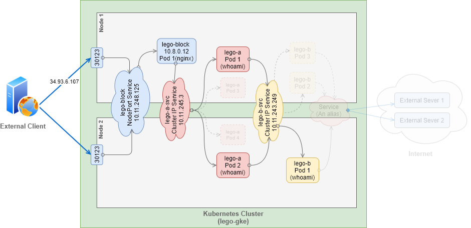
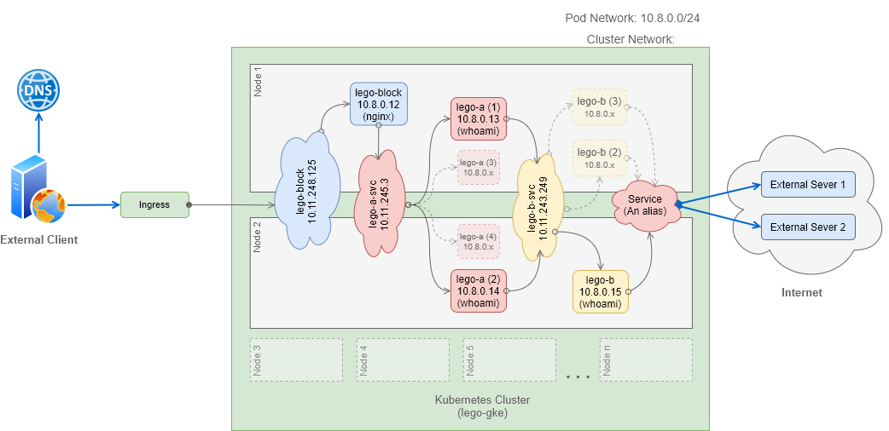
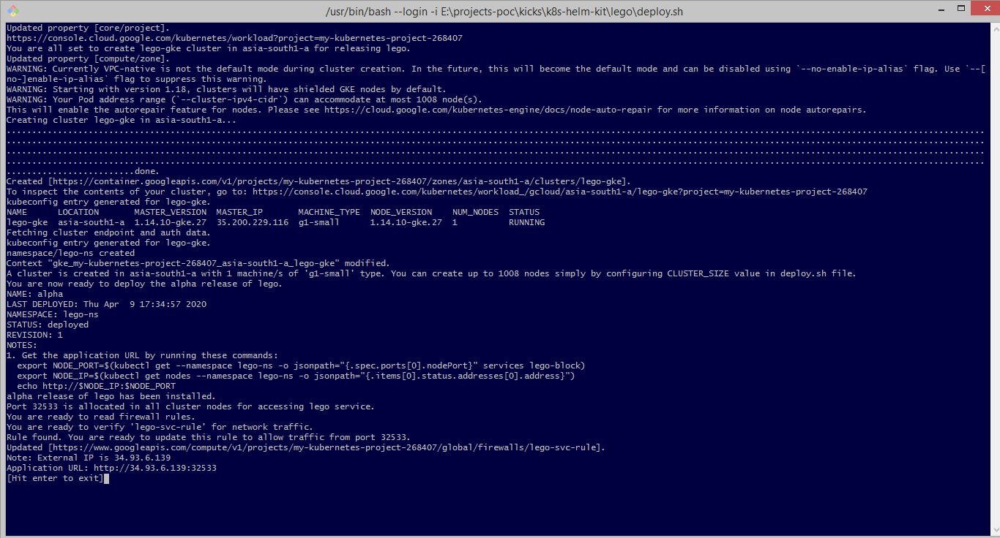
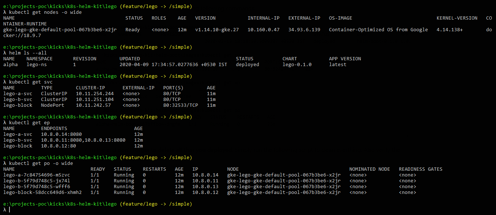
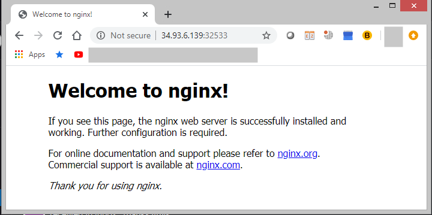
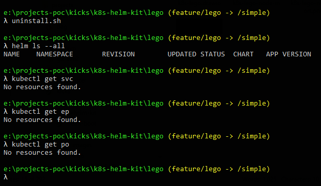

# **Lego**

Lego is a microservice styled distributed architecture that demonstrates different ways of facilitating communication within a kubernetes cluster.


# 1. Exposing pods through service

The lego-a, lego-b and lego-block are ephemeral pods and like any scalable backend services would come & go when scaled up, down, moved around to create room for other components or when some node fails. Kubernetes gives each pod a new IP address as soon they come to life and get scheduled on a node.

I created lego-a-svc and lego-b-svc as **ClusterIp Services** to expose lego-a and lego-b pod instances. These ClusterIp services will allow pods to find and communicate with each other over a stable IP address/port. The service IP address/port will not change as long as the service itself exists.

In the non-k8s world a sysadmin would be required to hard-code each client app's config file with the exact IP address or host name of the server providing the service. In an elatic environment it will be very difficult to keep doing these changes manually.

## 1.1 Discovering Services

By creating a service you get a single and stable IP address/port that can be used to access pods. This address will remain unchanged while the pods behind these services can come and go. The service IP address/port can either be obtained through environment variables or DNS.

To know the exact environment variable names, select any pod (say lego-a-7c84754696-m5zvc) and fired curl like so:
```
λ kubectl exec lego-a-7c84754696-m5zvc env
```

### Note
This lego application only demonstrates the architectural layout of services in a typical distributed system. For the purpose of testing inter-pod communication through a services I picked one pod, did SSH and fire a curl command.
```
ctl exec lego-a-7c84754696-m5zvc -- curl -s http://lego-b-svc:80
```

If you are programming a microservice-client pod it is easy to write code that sends request to other pods by directly referring to their service name without hardcoding their client-ip/port. 

Moreover, if you still need to know the IP address and ports of the service, simply write code to access environment variables or loop through DNS records using "service name".

## 1.2 Session Affinity

Redirecting all requests made by a certain client to be redirected to the same pod every time.

```
coming soon...
```

## 1.3 Exposing Multiple Ports

1. Have lego pods listen to 8080 and 8443 for http and https respectively
2. Have multiple ports, say Http 80 and Https 443, in the same service forward packets to the above 8080 and 8443 on the the pods.
    ```
    apiVersion: v1
    kind: Service
    metadata:
    name: lego-block
    spec:
    ports:
        - port: 80
        targetPort: 8080
        protocol: TCP
        name: http
        - port: 443
        targetPort: 8443
        protocol: TCP
        name: https
    ```


# 2. Exposing services to external clients

## 2.1. NodePort Service

With NodePort service we can allow external clients to access services running inside a cluster through any node's IP address and a reserved node port.




## 2.2. Ingress Resource 

* With Ingress service we can allow external clients to access services running inside a cluster.

    

* We can even expose multiple services through the same Ingress resource.

    ```
    Coming soon...
    ```


# 3. Exposing pods to external clients

## 3.1 Exposing a selected pod

* Port Forwarding

    ```
    Coming soon...
    ```

## 3.2 Exposing every pod in a cluster

Allowing external clients to directly access pods inside a cluster through **Headless Service**.

```
Coming soon...
```


# 4. Accessing External Services

## 4.1 Using manually managed end points

```
Coming soon...
```

## 4.2 Using Alias (spec.type=ExternalName)
Here I wrote a service yaml that played a role of an alias, a forward proxy to an external service (registry.hub.docker.com)

```
Coming soon...
```


---

# **Deployment & Testing**

# Setup Environment
```
λ gcloud init
```

# Deploy Cluster
```
λ deploy.sh
```


# Install Lego
```
λ install.sh
```

# Verify Application





# Test Lego

## Inter-pod communication via service

Pod lego-a-7c84754696-m5zvc calling service lego-b-svc

Service lego-b-svc invoking pod lego-b-5f79d748c5-jx74l

```
e:\projects-poc\kicks\k8s-helm-kit\lego (feature/lego -> /simple)
λ kubectl get svc
NAME         TYPE        CLUSTER-IP      EXTERNAL-IP   PORT(S)        AGE
lego-a-svc   ClusterIP   10.11.254.244   <none>        80/TCP         39m
lego-b-svc   ClusterIP   10.11.251.104   <none>        80/TCP         39m
lego-block   NodePort    10.11.242.57    <none>        80:32533/TCP   39m

e:\projects-poc\kicks\k8s-helm-kit\lego (feature/lego -> /simple)
λ kubectl get po
NAME                          READY   STATUS    RESTARTS   AGE
lego-a-7c84754696-m5zvc       1/1     Running   0          39m
lego-b-5f79d748c5-jx74l       1/1     Running   0          39m
lego-b-5f79d748c5-wfff6       1/1     Running   0          39m
lego-block-58dcc649d6-xhmh2   1/1     Running   0          39m

e:\projects-poc\kicks\k8s-helm-kit\lego (feature/lego -> /simple)
λ kubectl exec -it lego-a-7c84754696-m5zvc bash

root@lego-a-7c84754696-m5zvc:/# curl http://lego-b-svc:80
{"client":"::ffff:10.8.0.14","host":"lego-b-5f79d748c5-jx74l","timestamp":"2020-04-09T12:46:20.341Z","argv":["/usr/local/bin/node","/app.js","8080","lego-b","describe"],"app":{"name":"lego-b","version":"1.0.0","platform":"Node.Js"}}
```

Pod lego-b-5f79d748c5-jx74l calling service lego-a-svc

Service lego-a-svc invoking pod lego-a-7c84754696-m5zvc

```
e:\projects-poc\kicks\k8s-helm-kit\lego (feature/lego -> /simple)
λ kubectl exec -it lego-b-5f79d748c5-jx74l bash

root@lego-b-5f79d748c5-jx74l:/# curl http://lego-a-svc:80
{"client":"::ffff:10.8.0.11","host":"lego-a-7c84754696-m5zvc","timestamp":"2020-04-09T12:41:41.847Z","argv":["/usr/local/bin/node","/app.js","8080","lego-a","describe"],"app":{"name":"lego-a","version":"1.0.0","platform":"Node.Js"}}
```

Pod lego-b-5f79d748c5-jx74l invoking sevice lego-block 

Service lego-block invoking pod lego-block-58dcc649d6-xhmh2

```
e:\projects-poc\kicks\k8s-helm-kit\lego (feature/lego -> /simple)
λ kubectl exec -it lego-b-5f79d748c5-jx74l bash

root@lego-b-5f79d748c5-jx74l:/# curl http://lego-block:80
<!DOCTYPE html>
<html>
<head>
<title>Welcome to nginx!</title>
<style>
    body {
        width: 35em;
        margin: 0 auto;
        font-family: Tahoma, Verdana, Arial, sans-serif;
    }
</style>
</head>
<body>
<h1>Welcome to nginx!</h1>
<p>If you see this page, the nginx web server is successfully installed and
working. Further configuration is required.</p>


<p>For online documentation and support please refer to
<a href="http://nginx.org/">nginx.org</a>.<br/>
Commercial support is available at
<a href="http://nginx.com/">nginx.com</a>.</p>


<p><em>Thank you for using nginx.</em></p>
</body>
</html>
```

# Uninstall Lego




# Cleanup

```
λ undeploy.sh
```